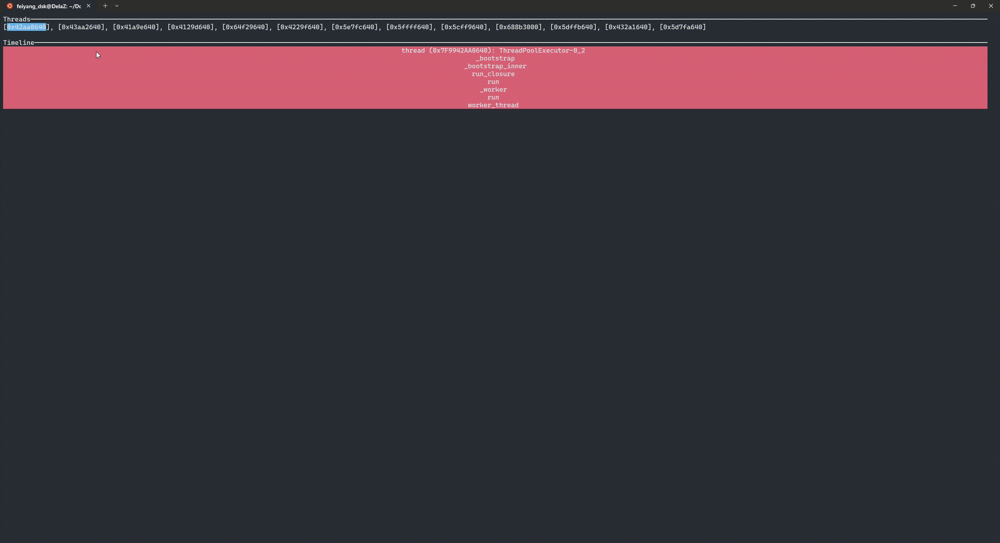

# FadeTop

FadeTop is a real-time visualizer for Python stack samples in the terminal.




FadeTop relies on **py-spy** for generating stack traces and **ratatui** for its front-end interface.

## Usage
To use FadeTop, run the following command:

```sh
fadetop $PID_OF_YOUR_RUNNING_PYTHON_PROCESS
```

Replace `$PID_OF_YOUR_RUNNING_PYTHON_PROCESS` with the process ID of the Python program you want to analyze.

## Installation [Work in Progress]
I am working on packaging a binary with maturin for distribution via PyPI.
Currently the only way to install is to clone this repository and `cargo build`.

## Forgetting about Recorded Events [Work in Progress]
While FadeTop helps identify performance patterns, it is not a full-fledged profiler.

A profiler retains detailed information about the runtime of various components in a program. In contrast, tools like `top` provide a summary of the current state or a short recent time window. FadeTop aims to sit somewhere in between and pop out insignificant/long-past events, so that its memory usage stays controlled over the life of a long-running python process.


I am still working on allowing the user to parametrise that curve in the chart above.

